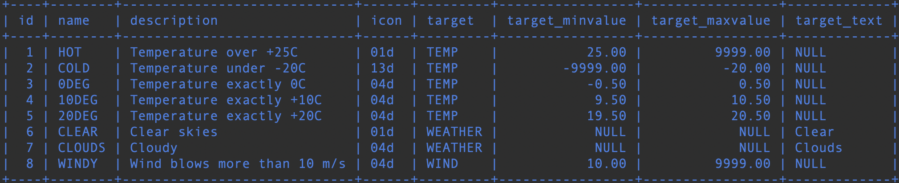
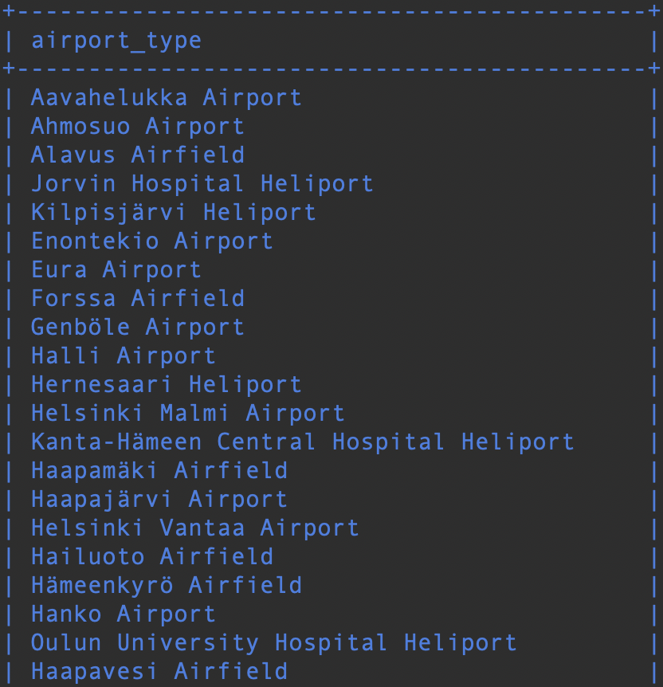

# Yhteen tauluun kohdistuvat kyselyt

### Tehtävä 1

Tee kysely, joka tulostaa kaikki sarakkeet goal-talusta.
```sql
SELECT * FROM goal;
```


### Tehtävä 2
Tee kysely, joka tulostaa nimen ja tyypin kaikista Suomessa sijaitsevista lentokentistä. Suomen maatunnus on: FI.
```sql
SELECT name, type FROM airport WHERE country = 'FI';
```


### Tehtävä 3
Tee kysely, joka tulostaa suomalaisten lentokenttien nimet aakkosjärjestyksessä. Suomen maatunnus: FI
```sql
SELECT name FROM airport WHERE country = 'FI' ORDER BY name;
```
 
