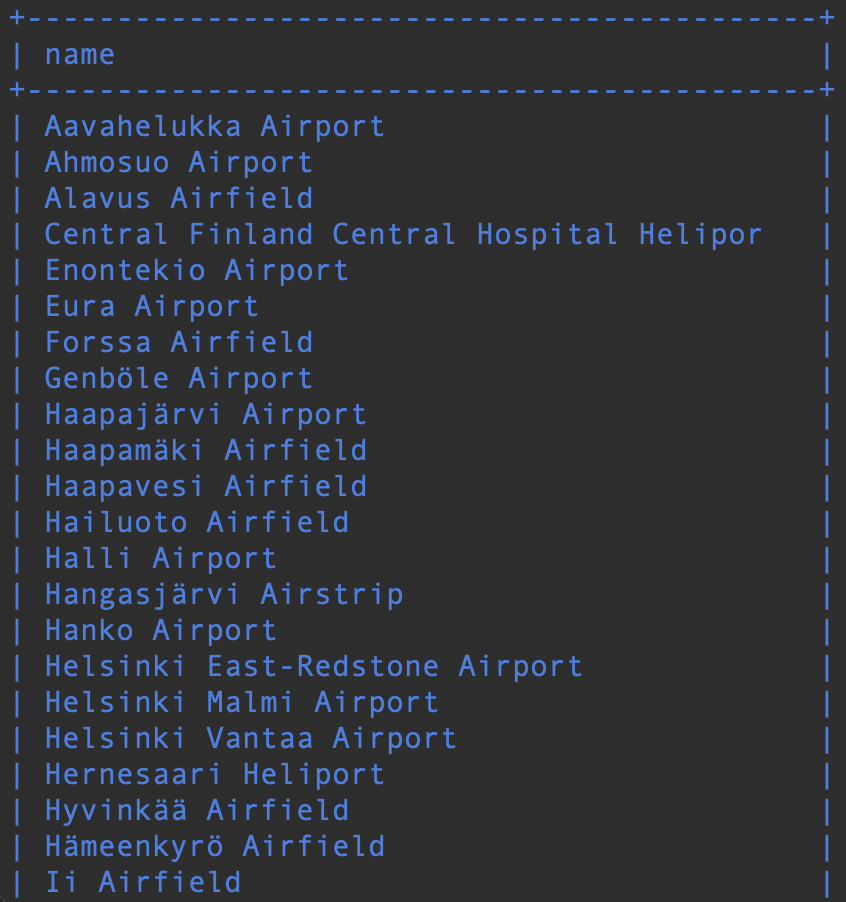

# Yhteen tauluun kohdistuvat kyselyt

### Tehtävä 1

Tee kysely, joka tulostaa kaikki sarakkeet goal-talusta.
```sql
SELECT * 
FROM goal;
```


### Tehtävä 2

Tee kysely, joka tulostaa nimen ja tyypin kaikista Suomessa sijaitsevista lentokentistä. Suomen maatunnus on: FI.
```sql
SELECT name, type 
FROM airport 
WHERE iso_country = 'FI';
```


### Tehtävä 3

Tee kysely, joka tulostaa suomalaisten lentokenttien nimet aakkosjärjestyksessä. Suomen maatunnus: FI.
```sql
SELECT name 
FROM airport 
WHERE iso_country = 'FI' ORDER BY name;
```


### Tehtävä 4

Tee kysely, joka tulostaa nimen ja tyypin kaikista Suomessa sijaitsevista lentokentistä. Järjestä tulos ensisijaisesti tyypin mukaan ja toissijaisesti nimen mukaan.
```sql
SELECT name, type 
FROM airport 
WHERE iso_country = 'FI' ORDER BY type, name;
```


### Tehtävä 5

Tee kysely, joka tulostaa kaikki F-kirjaimella alkavat maan nimet country-taulusta.
```sql
SELECT name 
FROM country 
WHERE name LIKE 'F%';
```


### Tehtävä 6

Tee kysely, joka tulostaa kaikki country-taulun maiden nimet, joissa esiintyy F-kirjain.

```sql
SELECT name 
FROM country 
WHERE name LIKE '%F%';
```


### Tehtävä 7

Missä locationissa Vesa sijaitsee?
```sql
SELECT location 
FROM game 
WHERE screen_name = 'Vesa';
```


### Tehtävä 8

Kuinkan paljon Ilkka on kuluttanut CO2 budjettia?
```sql
SELECT co2_consumed 
FROM game 
WHERE screen_name = 'Ilkka';
```


### Tehtävä 9

Kuinka paljon alkuperäinen CO2 budjetti on (tulosta CO2 budjetin arvo vain kerran)?
```sql
SELECT DISTINCT co2_budget 
FROM game;
```

