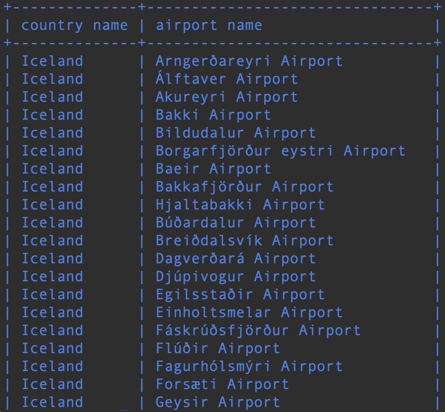
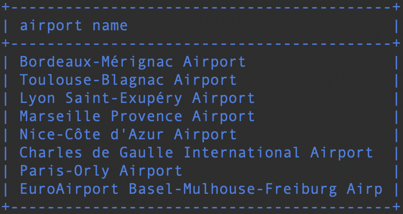
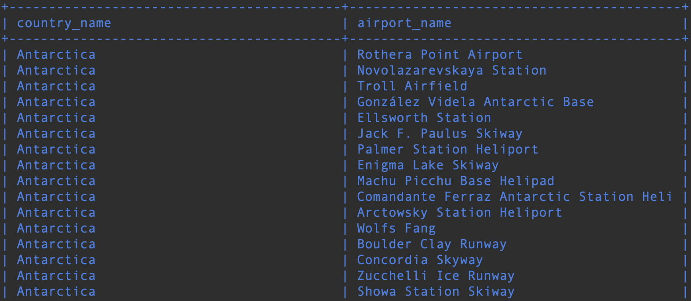
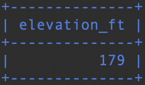
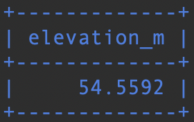
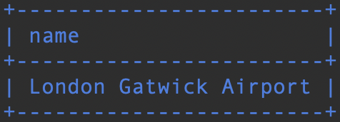
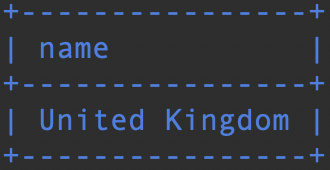
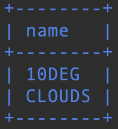
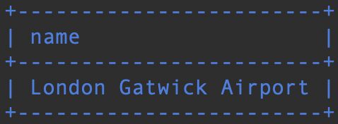
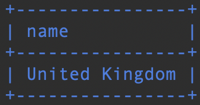

# Where osan liitosehto

### Tehtävä 1

Tee kysely, joka listaa maan nimen ja lentokentän nimen. Valitse maaksi Islanti ja anna country-taulun name-kentälle alias ”country name” ja airport taulun name-kentälle alias ”airport name”.
```sql
SELECT country.name AS 'country name', airport.name AS 'airport name' FROM airport, country WHERE airport.iso_country = country.iso_country AND country.name = "Iceland";
```


### Tehtävä 2

Listaa Ranskan isojen lentokenttien nimet. Anna kentän nimelle alias "airport name".

Vihje: Käytettävä maan nimi on "France".
```sql
SELECT airport.name AS 'airport name' FROM airport, country WHERE airport.iso_country = country.iso_country AND country.name = "France" AND airport.type = "large_airport";
```


### Tehtävä 3

Tee kysely, joka listaa kaikki Antarktiksella sijaitsevien lentokenttien nimet ja vastaava maan nimi. 

Käytä aliaksia country_name ja airport_name. SQLLite ei salli kahdesta sanasta koostuvaa aliasta. MariaDB sallii jos aliaksen ympärillä on lainausmerkit.

Vihje: Continent = "AN"
```sql
SELECT country.name AS 'country_name', airport.name AS 'airport_name' FROM airport, country WHERE airport.iso_country = country.iso_country AND country.continent = "AN";
```


### Tehtävä 4

Kuinka korkealla Heini on paraikaa merenpinnasta mitattuna?
```sql
SELECT elevation_ft FROM airport, game WHERE location = ident AND screen_name = 'Heini';
```


### Tehtävä 5

Kuinka korkealla Heini on paraikaa merenpinnasta mitattuna? Anna tulos metreissä, ja anna tulokselle alias elevation_m. Yksi jalka on 0,3048 metriä. Älä käytä muuttujaa. Voit kuitenkin tehdä laskutoimituksen ilman muuttujaa.
```sql
SELECT name FROM country WHERE name LIKE 'F%';
```


### Tehtävä 6

Minkä nimisellä lentokentällä Ilkka on?

```sql
SELECT name FROM airport, game WHERE ident = location AND screen_name = 'Ilkka';
```


### Tehtävä 7

Minkä nimisessä maassa Ilkka on?
```sql
SELECT country.name FROM country, airport, game WHERE country.iso_country = airport.iso_country AND ident = location AND screen_name = 'Ilkka';
```

    
### Tehtävä 8
    
Minkä nimiset säätila-tavoitteet Heini on saavuttanut?
```sql
SELECT name FROM goal, goal_reached, game WHERE game.id = game_id AND goal.id = goal_id AND screen_name = 'Heini';
```


### Tehtävä 9

 Minkä nimisellä lentokentällä Ilkka saavutti säätilan clouds?
```sql
SELECT airport.name FROM airport, game, goal, goal_reached WHERE ident = location AND game.id = game_id AND goal.id = goal_id AND screen_name = 'Ilkka' AND goal.name = 'clouds';
```


### Tehtävä 10

Minkä nimisessä maassa Ilkka saavutti säätilan clouds?
```sql
SELECT country.name FROM country, airport, game, goal, goal_reached WHERE country.iso_country = airport.iso_country AND ident = location AND game.id = game_id AND goal.id = goal_id AND screen_name = 'Ilkka' AND goal.name = 'clouds';
```

