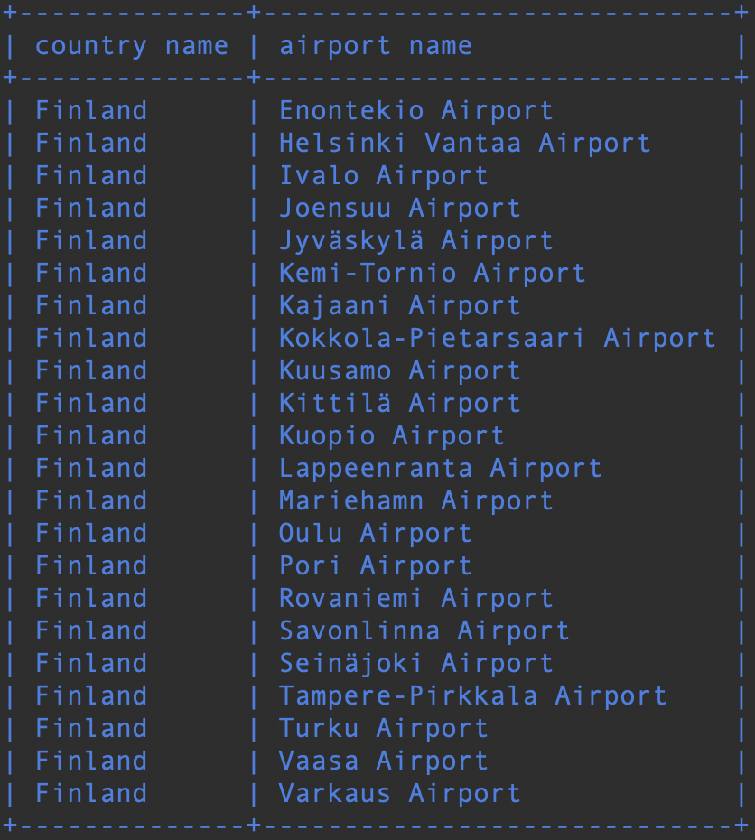

# Join

### Tehtävä 1

Luettele suomalaiset lentokentät, joilla on aikataulutettuja palveluja. Lopputulokseen halutaan sekä maan nimi että lentokentän nimi.

Vihje 1: Tarvittava maan nimi on ”Finland”.

Vihje 2: Kahdesta sanasta koostuvaan aliakseen tarvitset lainausmerkit ympärille.
```sql
SELECT country.name AS 'country name', airport.name AS 'airport name'
FROM country, airport
WHERE country.name = 'Finland' 
AND scheduled_service = 'yes';
```


### Tehtävä 2

Luettele pelaajanimet ja niiden lentokentrien nimet, joilla he ovat nyt.
```sql
SELECT screen_name, airport.name
FROM game INNER JOIN airport
ON location = ident;
```


### Tehtävä 3

Luettele pelaajanimet ja maat, joissa he ovat nyt.
```sql
SELECT screen_name, country.name
FROM game INNER JOIN airport
ON location = ident
INNER JOIN country ON 
country.iso_country = airport.iso_country;
```


### Tehtävä 4
    
Luette kaikkien niiden lentokenttien nimet, jotka sisältävät merkkijonon "Hels" ja pelaajan nimi, jos joku pelaaja sattuu ko. kentällä olemaan.
```sql
SELECT airport.name, screen_name
FROM airport LEFT JOIN game ON location = ident
WHERE name LIKE '%Hels%';
```


### Tehtävä 5

Luettele kaikki säätilatavoitteiden nimet ja pelaajan nimi, jos pelaaja on sen saavuttanut.
```sql
SELECT goal.name, screen_name
FROM goal LEFT JOIN goal_reached ON goal.id = goal_id LEFT JOIN game ON game.id = game_id;
```

