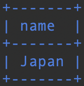
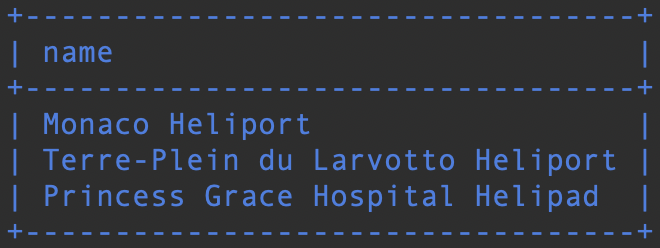
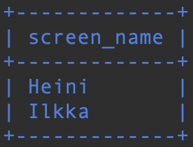

# Sisäkyselyt

### Tehtävä 1

Tee kysely, joka tulostaa kaikki pelaajat, jotka ovat saavuttaneet säätilatavoitteen "CLOUDS".
```sql
SELECT screen_name
FROM game
WHERE id IN (SELECT game_id
             FROM goal_reached
             WHERE goal_id IN (SELECT id
                               FROM goal
                               WHERE name = 'CLOUDS'));
```


### Tehtävä 2

Tee kysely, joka tulostaa kaikki pelaajat, jotka ovat saavuttaneet säätilatavoitteen "CLOUDS" ja ovat tällä hetkellä lentokentällä "EFHK".
```sql
SELECT screen_name
FROM game
WHERE id IN (SELECT game_id
             FROM goal_reached
             WHERE goal_id IN (SELECT id
                               FROM goal
                               WHERE name = 'CLOUDS'))
AND location = 'EFHK';
```


### Tehtävä 3

Tee kysely, joka tulostaa kaikki pelaajat, jotka ovat saavuttaneet säätilatavoitteen "CLOUDS" ja ovat tällä hetkellä lentokentällä "EFHK" ja ovat maassa "Finland".
```sql
SELECT screen_name
FROM game
WHERE id IN (SELECT game_id
             FROM goal_reached
             WHERE goal_id IN (SELECT id
                               FROM goal
                               WHERE name = 'CLOUDS'))
AND location = 'EFHK'
AND iso_country = 'FI';
```


### Tehtävä 4

Tee kysely, joka tulostaa kaikki pelaajat, jotka ovat saavuttaneet säätilatavoitteen "CLOUDS" ja ovat tällä hetkellä lentokentällä "EFHK" ja ovat maassa "Finland" ja ovat saavuttaneet säätilatavoitteen "RAIN".
```sql
SELECT screen_name
FROM game
WHERE id IN (SELECT game_id
             FROM goal_reached
             WHERE goal_id IN (SELECT id
                               FROM goal
                               WHERE name = 'CLOUDS'))
AND location = 'EFHK'
AND iso_country = 'FI'
AND id IN (SELECT game_id
           FROM goal_reached
           WHERE goal_id IN (SELECT id
                             FROM goal
                             WHERE name = 'RAIN'));
```

