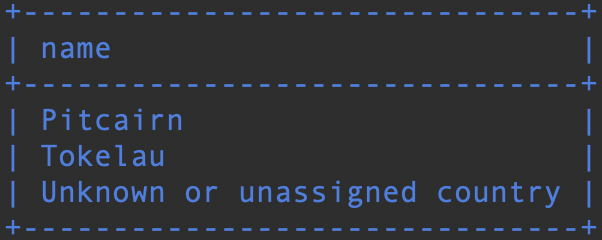

# Sisäkyselyt

### Tehtävä 1

Minkä nimisessä maassa sijaitsee sanalla ”Satsuma” alkava lentokenttä?
```sql
SELECT name
FROM country
WHERE iso_country IN(
    SELECT iso_country
    FROM airport
    WHERE name LIKE "Satsuma%"
);
```


### Tehtävä 2

Luettele Monacossa sijaitsevien lentokenttien nimet.
```sql
SELECT name
FROM airport
WHERE iso_country IN(
    SELECT iso_country
    FROM country
    WHERE name = "Monaco"
);  
```


### Tehtävä 3

 Luettele nimimerkit, jotka ovat saavuttaneet säätilatavoitteen pilvistä (CLOUDS).
```sql
SELECT screen_name
FROM game
WHERE id IN(
    SELECT game_id
    FROM goal_reached
    WHERE goal_id IN(
        SELECT id
        FROM goal
        WHERE name = "CLOUDS"
    )
);
```


### Tehtävä 4

Luettele kaikki maat, joissa ei ole lentokenttää.

Vihje: Tarvitset negaatiota NOT IN.
```sql
SELECT country.name
FROM country
WHERE iso_country NOT IN(
    SELECT airport.iso_country
    FROM airport
);
```


### Tehtävä 5

Minkä nimiset säätilatavoitteet Heiniltä on saavuttamatta?

Vihje: Tarvitset negaatiota NOT IN.
```sql
SELECT name
FROM goal
WHERE id NOT IN(
    SELECT goal_id
    FROM goal, goal_reached, game
    WHERE game.id = game_id 
    AND goal.id = goal_id 
    AND screen_name = "Heini"
);
```     

