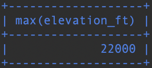

# Koostetietokyselyt

### Tehtävä 1

Kuinka korkealla sijaitsee korkeimmalla sijaitseva lentokenttä?
```sql
SELECT MAX(elevation_ft)
FROM airport;
```


### Tehtävä 2

Tee kysely, joka listaa kunkin maanosan, ja niissä sijaitsevien maiden määrän.
```sql
SELECT continent, count(*)
FROM country
GROUP BY continent;
```

