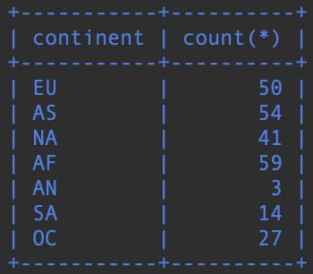

# Koostetietokyselyt

### Tehtävä 1

Kuinka korkealla sijaitsee korkeimmalla sijaitseva lentokenttä?
```sql
SELECT max(elevation_ft)
FROM airport;
```


### Tehtävä 2

Tee kysely, joka listaa kunkin maanosan, ja niissä sijaitsevien maiden määrän.
```sql
SELECT continent, count(*)
FROM country
GROUP BY continent;
```


### Tehtävä 3

Tulosta pelaajien nimimerkit ja pelaajien saavuttamien säätilatavoitteiden lukumäärät.
```sql
SELECT screen_name, count(*)
FROM game
JOIN goal_reached ON game.id = goal_reached.game_id
GROUP BY screen_name;
```


### Tehtävä 4

Mikä nimimerkki on kuluttanut vähiten hiilijalanjälkeä?

Vihje2: Vaikka kysely kohdistuu yhteen tauluun tarvitset sisäkyselyä.
```sql
SELECT screen_name
FROM game
WHERE co2_consumed in(
    SELECT min(co2_consumed)
    FROM game
);
```


### Tehtävä 5

Tulosta maan nimi ja lentokenttien lukumäärä kyseisessä maassa. Järjestä tulokset siten, että ylimpänä listassa ovat maat, joissa on eniten lentokenttiä. Ota mukaan vain 50 eniten lentokenttiä sisältävää maata.
```sql
SELECT country.name, count(*)
FROM airport, country
WHERE airport.iso_country = country.iso_country
GROUP BY country.iso_country
ORDER BY count(*) DESC
LIMIT 50;
```


### Tehtävä 6

Tulosta niiden maiden nimi, joissa on yli 1000 lentokenttää.

Vihje: Tee ryhmittely iso_country-kentän avulla. (Ei maan nimellä)
```sql
SELECT country.name
FROM airport, country
WHERE airport.iso_country = country.iso_country
GROUP BY country.iso_country
HAVING count(*) > 1000;
```


### Tehtävä 7

Minkä niminen on maailman korkeimmalla sijaitseva lentokenttä?

Vihje1: Älä käytä desc limit, jos meillä on useampi lentokenttä yhtä korkealla; desc limit poimii niistä vain yhden. Me haluamme kaikki korkeimmalla sijaitsevat lentokentät.

Vihje2: Vaikka kysely kohdistuu yhteen tauluun tarvitset sisäkyselyä.
```sql
SELECT name
FROM airport
WHERE elevation_ft in(
    SELECT max(elevation_ft)
    FROM airport
);
```


### Tehtävä 8

Missä maassa sijaitsee maailman korkeimmalla oleva lentokenttä?

Vihje1: Älä käytä desc limit, jos meillä on useampi lentokenttä yhtä korkealla; desc limit poimii niistä vain yhden. Me haluamme kaikki korkeimmalla sijaitsevien lentokenttien maat.

Vihje 2: Sisäkyselyt ovat käteviä tähän.
```sql
SELECT country.name
FROM airport, country
WHERE airport.iso_country = country.iso_country
AND elevation_ft in(
    SELECT max(elevation_ft)
    FROM airport
);
```

