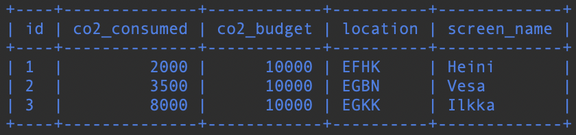

# Päivityskyselyt

### Tehtävä 1

Vesa lentää nykyiseltä sijainnilta Nottingham Airport:lle. Samalla Vesan hiilijalanjälki kasvaa 500:lla. Päivitä nämä tiedot tietokantaan.

Vihje1: Tarvitset sisäkyselyn selvittääksesi Nottingham Airportin identin.
```sql
UPDATE game
SET location = (
    SELECT ident
    FROM airport
    WHERE name = "Nottingham Airport"
), co2_consumed = co2_consumed + 500
WHERE screen_name = "Vesa";
```
Game-taulun sisältä näyttää päivituksen jälkeen seuraavalta:


### Tehtävä 2

Ja nyt alustetaan oma tietokanta valmiiksi projektin kannalta. Eli poistetaan kaikki pelin tilaan liittyvä testidata. Viite-eheyden takia pystyt poistamaan datan vain fiksussa järjestyksessä.

Täytyykö sinun poistaa ensin data game-taulusta vai goal_reached taulusta?
a) goal_reached
b) game

Vastaus a) goal_reached

### Tehtävä 3

Poista data goal_reahed-taulusta.
```sql
DELETE FROM goal_reached;
```
Taulun sisältö näyttää seuraavalta:
```sql
MySQL [flight_game]>
MySQL [flight_game]> SELECT * FROM goal_reached;
Empty set (0.00 sec)
```
```sql
id          game_id     goal_id
----------  ----------  ----------
```


